<div align="center">



[](https://git.io/typing-svg)

<br/>

[](https://github.com/mvnuel9)
[](https://mvnuel.com)
[](mailto:luckemmanuel09@gmail.com)
[]()

</div>

---

## 👋 À propos de moi

```bash
$ cat about.md

# Luck-Emmanuel Koffi — Développeur FullStack & Product Builder
# 📍 Abidjan, Côte d'Ivoire

Je pense produit autant que code. Je n'aime pas juste écrire des
features : j'aime construire des choses qui marchent, de bout en
bout — de l'architecture backend jusqu'à l'expérience utilisateur.
Web moderne, mobile cross-platform, outillage : si ça sert le
produit, ça m'intéresse.

```

---

## 🚀 Stack technique

<div align="center">

<table>
<tr>
<td align="right"><b>🔧 Backend</b></td>
<td>
  
  
  
</td>
</tr>
<tr>
<td align="right"><b>🎨 Frontend</b></td>
<td>
  
  
  
  
  
</td>
</tr>
<tr>
<td align="right"><b>📱 Mobile</b></td>
<td>
  
  
</td>
</tr>
<tr>
<td align="right"><b>🛠️ Outils</b></td>
<td>
  
  
  
  
</td>
</tr>
</table>

</div>

---

## 📊 Statistiques GitHub

<div align="center">


<br/>


<br/>


</div>

---

## 🤝 Me contacter

<div align="center">

Vous avez un projet en tête, une opportunité ou juste envie d'échanger ? N'hésitez pas !

[](https://mvnuel.com)
[](mailto:luckemmanuel09@gmail.com)

</div>

---

<div align="center">


*"Au delà des limites, plus ULTRA 🚀"*

<sub>© 2026 Luck-Emmanuel Koffi — construit avec curiosité et beaucoup de café ☕</sub>

</div>
